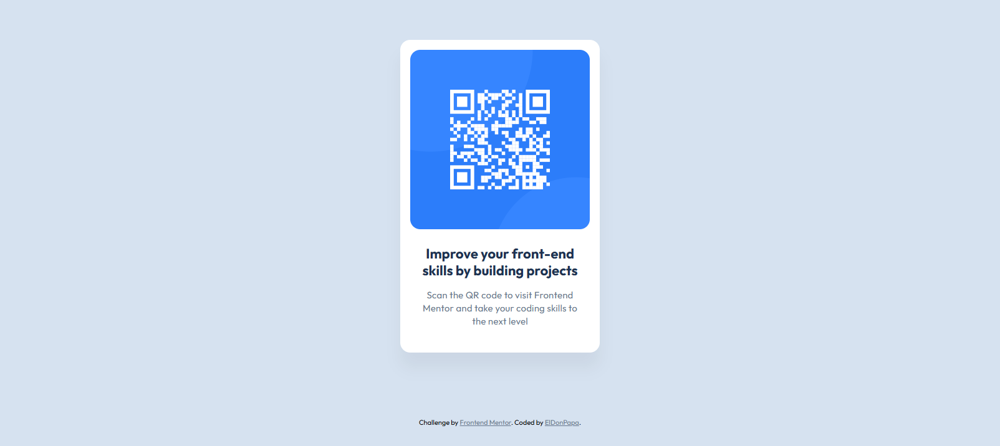

# Frontend Mentor - QR code component solution

This is a solution to the [QR code component challenge on Frontend Mentor](https://www.frontendmentor.io/challenges/qr-code-component-iux_sIO_H). Frontend Mentor challenges help you improve your coding skills by building realistic projects. 

## Table of contents

- [Overview](#overview)
  - [Screenshot](#screenshot)
  - [Links](#links)
- [My process](#my-process)
  - [Built with](#built-with)
  - [What I learned](#what-i-learned)
- [Author](#author)

## Overview

### Screenshot

### Links

- Live site URL: [frontendmentor-qrcode-two.vercel.app](https://frontendmentor-qrcode-two.vercel.app/)
- Solution URL: [www.frontendmentor.io/solutions/simple-solution-using-plain-html-css-and-bem-convention-03pSvWrm8](https://www.frontendmentor.io/solutions/simple-solution-using-plain-html-css-and-bem-convention-03pSvWrm8_)

## My process

### Built with

- Semantic HTML5 markup
- CSS custom properties
- Flexbox
- [Vite](https://vite.dev/) - Build tool

### What I learned

This project mainly helped me getting familiar with plain HTML and CSS again, which in the current frontend dev landscape, filled with frameworks upon frameworks, seems easy but can be challenging.

The main thing that I learned doing this challenge can seem silly, but it's the following CSS property:

```css
width: min-content;
```
Which as the name implies, allows the container to be as thin as possible, without crushing the content inside it (which was the QR code in this case). It can seem obvious, but I wasn't aware that this existed and it saved me lol.

And I also was able to put in practice what I've learned some times ago, like the BEM naming convention. (Although the project was maybe a bit too small to really see the benefits of it)
## Author

- Frontend Mentor - [@ElDonPapa](https://www.frontendmentor.io/profile/ElDonPapa)
